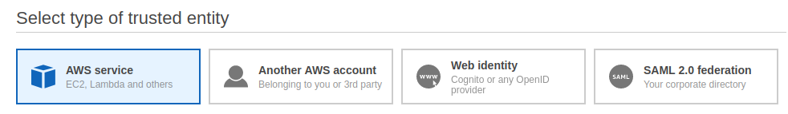

# IAM

## Root User

### Securing the root user
* Activate MFA for root user.
* Delete root user access keys.
* Create IAM users for administrators.
    * Create Administrators groups.
    * Attach AdministratorAccess policy to the group.
    * Assign users to the group.
* Limit root user actions with SCPs (Service Control Policies).
* Apply a secure IAM password policy.

### Actions that only a root user can do
* Change account settings (account name, email, root password).
* Change AWS support plan.
* View certain tax invoices.
* Restore IAM user permissions.
* Register as a seller in RI marketplace.
* Create CloudFront key pair.
* Configure S3 bucket with MFA delete.
* Resolve S3 bucket policy with invalid VPC ID or VPC endpoint ID.
* Sign up for GovCloud.
* Close AWS account.

## Policies
### Identity based policies
* Attached to a user, group or role.
* Manged policies
    * AWS Managed (common use cases), or Customer Managed
    * Can be attached to multiple identities.
* Inline policies
    * Embedded with the entity.
    * Deleted when entity is deleted.

### Resource based policies
* Attached to a resource.
* Not all AWS services support resource based policies. Typically used for S3, SQS, VPC endpoints, and KMS keys.
* Can be used for cross-account access.

### Cross-account Access
* For requests made from one account to another, the requester in Account A must have:
    * an identity-based policy that allows them to make a request to the resource in Account B. 
    * Also, the resource-based policy in Account B must allow the requester in Account A to access the resource. 

## AWS IAM Access Analyzer
* AWS IAM Access Analyzer helps you identify the resources in your organization and accounts, such as Amazon S3 buckets or IAM roles, shared with an external entity. 

## Roles
* AWS identity with name and policies.
* No credentials.
* For temporary delegated access to trusted entities.

* IAM Role scenarios:
  * One AWS service accesses another AWS service.
  * One AWS account accesses another AWS account.
  * A third-party web identity needs access.
  * Authentication using SAML2.0 federation.
* When a user assumes a role, they temporarily given up their own permissions.
* An entity must be granted permissions to assume a role.
```json
{
  "Version": "2012-10-17",
  "Statement": {
    "Effect": "Allow",
    "Action": "sts:AssumeRole",
    "Resource": "arn:aws:iam::ACCOUNT-ID-WITHOUT-HYPHENS:role/Test*"
  }
}
```
* An adminstrator can revoke a roles active sessions.
* Access Advisor for a role shows activity.

### Service-linked Roles
* Only assumed by a AWS service.
* Permissions to call other AWS services.
* e.g. EC2 Auto Scalling (Create and terminate EC2 instances; Register instances with load balancer; Cloudwatch alarms).
* IAM user creating the service must have permissions to create the service-linked role.

## Cross-account access with roles
### Trusting Account (e.g. Production account)
* Create role in trusting account to allow access to users from the trusted account.
* The role will have relevant policies attached.
### Trusted Account (e.g. Security account)
* Create group in trusted account.
* Add trusted users to group.
* Add policy to group that allows members to assume the trusting account role.

## Cross-account access with resource based policies
* With resource-based policies, you can specify who has access to the resource and what actions they can perform on it. 

### IAM Access Analyzer
* AWS IAM Access Analyzer helps you identify the resources in your organization and accounts, such as Amazon S3 buckets or IAM roles, that are shared with an external entity.

## SSO and Federation
* AWS Single-Sign on
* Enable SSO (in master account)
* Choose identity source:
    * AWS SSO
    * Active Directory
        * AWS Managed AD, or AD Connector
    * External OIDC IdP
* Add Users
* Add Groups
* Add users to groups
* Assign users or groups to accounts
* Create permission sets for users or groups / account relationships
    * Custom permission set
    * Job function policy
        * AdministratorAccess
        * Billing
        * DataScientist
        * DatabaseAdministrator
        * NetworkAdministrator
        * PowerUserAccess
        * SecurityAudit
* AWS creates roles based on the selected permission sets with the identity provider as the trusted entity.
* Add Applications for SSO

## AWS Security Token Service (STS)
* Temporary credentials (no need to embed or rotate keys)
* Limited permissions
* No IAM users required
* STS enables SAML 2.0 federation
* Amazon Cognito
