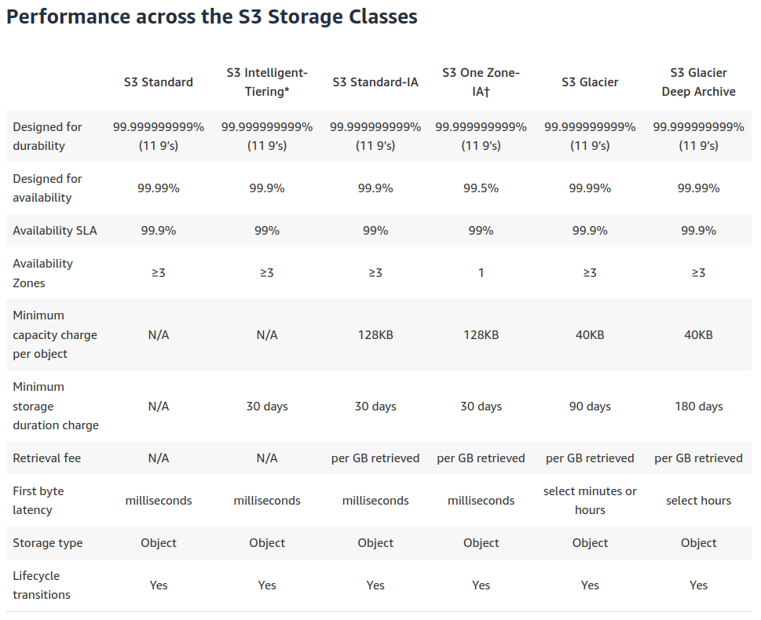

# S3

* Simple Storage Service.
* 11 9's (99.999999999) durability.
* Designed for 99.5% to 99.99% availability (although SLAs are lower)

### Limits

* Each object, maximum of 5TB.
* Single PUT is limited to 5GB.
* Use muiltipart upload for objects > 100 MB.

### Bucket Types

* General Purpose
    * default, recommended for majority of use cases
    * flat storage structure
    * objects stored across at minimum 3 AZs in then given region
* Directory
    * for performance-critical applications that require consistent single-digit millisecond latency
    * organize data hierarchically into directories
    * can elastically scale performance to support hundreds of thousands of transactions per second (TPS)
    * support only the S3 Express One Zone storage class and a limited set of Amazon S3 features

### Storage Classes

* S3 Standard
    * General purpose store for frequently accessed data.
* S3 Intelligent-Tiering
    * Data with unknown or changing access patterns.
* S3 Standard-IA (Infrequent Access)
    * Long-lived less frequently accessed data.
* S3 One Zone-IA
    * Long-lived less frequently accessed data.
    * Same durability as Standard, but lower availability (99.5%)
* S3 Glacier
    * Long-term archive
* S3 Glacier Deep Archive
    * Long-term archive
* S3 Outposts
    * Store S3 data on-premise.

### Consistency Model

* Strong read-after-write consistency (for PUTs and DELETEs)
* Eventual consistency (for bucket configurations, including DELETEs and enabling versioning - wait 15 mins).

### Security

#### ACLs

* Each bucket has an ACls attached as a sub-resource
* Generally not recommended

### Pricing Model

* Storage costs
    * can vary significantly by storage class.
* Request and Data Retrieval costs (Data retrieval from IA and  Glacier archives)
* Data transfer costs, except for:
    * Data transferred in from the internet.
    * Data transferred between S3 buckets in the same AWS Region. 
    * Data transferred from an Amazon S3 bucket to any AWS service(s) within the same AWS Region as the S3 bucket (including to a different account in the same AWS Region).
    * Data transferred out to Amazon CloudFront (CloudFront).

### S3 Replication

* Asynchronous replication across buckets
* Same-Region replication and Cross-Region replication 
    * automatically replicates new objects.
* Batch replication
    * replicates exiting objects 

### S3 Events

### S3 Logging

### Intelligent-Tiering Archive configuration

### S3 Glacier

* Files are stored as archives.
    * An archive can be up to 40TB.
* Archives are grouped in vaults.
* Event notifications can be enabled for the following job completion events:
    * Archive Retrieval Job Complete.
    * Vault Inventory Retrieval Job Complete.

### S3 Access Points

* Access points are named network endpoints that are attached to buckets that you can use to perform S3 object operations.
* Why?
    * Shared data sets
        * Decompose one large bucket policy into separate, discrete access point policies for each application that needs to access the shared data set.
    * Copy data securely
        * Between same-region access points.
    * Limit access to specific account IDs and VPCs
    * Provide a unique name within a region.

### S3 Object Lambda Access Points

### Encryption
* Disabled by default
* SSE-S3
    * S3 managed keys
    * Reduce the cost of SSE by up to 99% by decresing request traffic from S3 to KMS.
* SSE-KMS
    * KMS managed keys
    * Choice between AWSKMS managed key (aws/s3) of a custiomer managed key.
    * Why use a customer managed key:
        *  You want to grant cross-account access to your S3 objects.
        *  You want to create, rotate, diable or grant access policies for the key.     
* To encrypt existing Amazon S3 objects use tghe Batch Operations Copy operation.

### Access Analyzer for S3

Alerts you to S3 buckets that are configured to allow access to anyone on the internet or other AWS accounts, including accounts outside of your organization.
