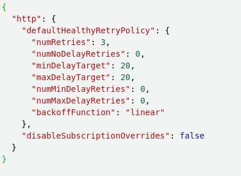

# SNS

SNS is a managed service that provides message delivery from publishers to subscribers (applications and persons).

Similarly to SQS, SNS has standard and FIFO topics.

FIFO topics guarantee message ordering and exactly-once message delivery. However, FIFO topics can only deliver messages to SQS FIFO queues.

Standard topics can deliver messages to the following targets:

* Kinesis Data Firehose
* Lambda
* SQS
* Event Fork Pipelines
* HTTP/S
* SMS
* Email
* Platform endpoint (Mobile push notifications)
* AWS Chatbox
* Pager Duty.

Standard topics do not guarantee message ordering and offer at-least-once delivery.

SNS offers string durability with messages persisted to multiple AZs.

## Delivery

### Delivery retry policies

SNS will attempt to push a message to a subscribed application.

Delivery retry policies define how SNS retries the delivery of a message when a server-side delivery error occurs.

A delivery retry policy has the following phases:

* Immediate Retry
    * Occurs immediately after a failed delivery. There is no delay in retries during this phase.
* Pre-Backoff
    * SNS attempts a number of retries with a fixed delay between them.
* Backoff
    * A retry-backoff function is used to control the delay between retries from a minimum to maximum delay.
* Post-Backoff
    * The final set of retries with a fixed delay between them.

The delivery retry policy for a topic is configurable for HTTP/S destinations, but fixed for other destinations.

The following is the delivery retry policy for AWS managed endpoints such as AWS Lambda:

* Immediate retry = 3 times without delay
* Pre-backoff = 2 times, 1 second apart
* Backoff = 10 times, with exponential backoff, from 1 second to 20 seconds
* Post-backoff = 100,000 times, 20 seconds apart

### Dead-letter queues

A dead-letter queue is an Amazon SQS queue that an Amazon SNS subscription can target for messages that can't be delivered to subscribers successfully.

A delivery failure may be the result of a client-side or server-side error.

A client-side error occurs when SNS has incorrect or stale subscription metadata. For example, when a lambda endpoint function is deleted or a policy change denies SNS access.

A server-side error when the system responsible for the subscribed endpoint becomes unavailable or returns an exception that indicates that it can't process a valid request from Amazon SNS.

When SNS receives a client-side error, or continues to receive a server-side error for a message beyond the number of retries specified by the corresponding retry policy, the message is discarded unless a dead-letter queue is attached to the subscription.

#### Processing messages in a dead-letter queue

A dead-letter queue can be configured as an event source for a Lambda function, or custom consumer logic can be implemented using the AWS SQS API, AWS SDK, or AWS CLI.

#### Monitoring dead-letter queues

Amazon CloudWatch metrics and alarms can be used to monitor dead-letter queues.

