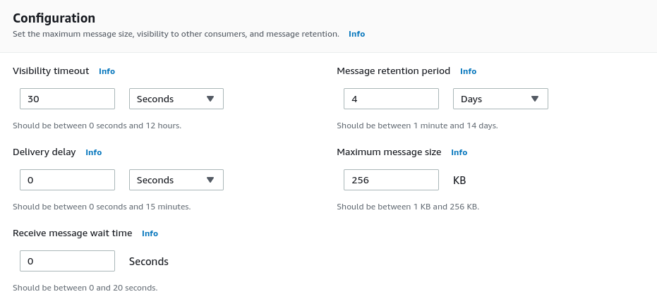
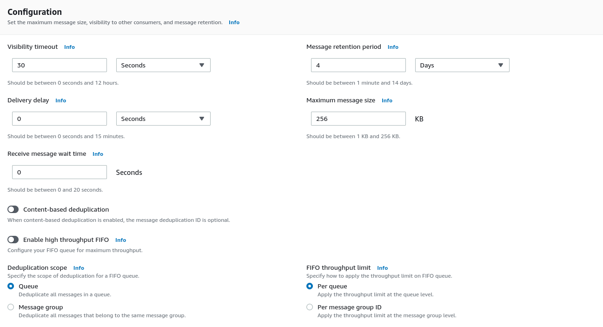
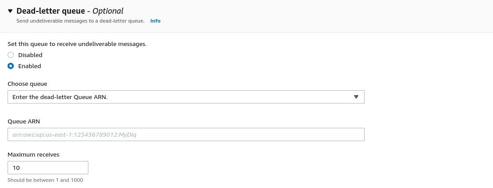

# Event Brokers

## SQS

AWS SQS is a serverless queue-oriented event broker.

When a message is written to a SQS topic, it is persisted to multiple servers and AZs to ensure redundancy and availability.

SQS does not directly support fan-out use cases as each message can only be processed by a single consumer. However fan-out can be achieved through a combination of SQS and SNS.

### SQS Queue Types

SQS has 2 queue types: Standard; and FIFO.

#### Standard Queues

Standard queue offer at-least-once delivery and best-effort ordering, so no ordering guarantees.

Standard queues support a nearly unlimited number of API calls per second, per API action (SendMessage, ReceiveMessage, or DeleteMessage).

When a standard queue is created it is configured with the following settings:

* Visibility timeout
    * The length of time that a message received by a consumer will not be visible to the other message consumers.
    * 0 to 12 hours (defaults to 30 seconds)
* Message rentention period
    * Amount of time that Amazon SQS retains a message that had not been deleted.
    * 1 minutes to 14 days (defaults to 4 days)
* Delivery delay
   * The amount of time to delay the first delivery of each message added to the queue.
   * 0 to 15 minutes (defaults to 0)
* Maximum message size
    * 1 KB to 256 KB (Defaults to 256 KB)
* Receive message wait time
    * The maximum amount of time that long polling will wait for messages to become available to receive. If set to 0 all receive requests use short polling.
    * 0 to 20 seconds (defaults to 0)

##### Workflow for a standard queue

A producer produces a message to a topic. The message is replicated across servers in multiple AZs.

After the delivery delay has completed the message will be available for consumption.

A consumer polls the topics for messages. A consumer has the choice of short polling or long polling.

With short polling, the requests queries a subset of the servers for messages. A response is sent straight away even if there are no messages.

With long polling, the request queries all of the servers for messages. Amazon SQS sends a response after it collects at least one available message, up to the maximum number of messages specified in the request. Amazon SQS sends an empty response when the receive message wait time expires. Long polling helps reduce the cost of using Amazon SQS by eliminating the number of empty responses (when there are no messages available for a ReceiveMessage request) and false empty responses (when messages are available but aren't included in a response).

When a consumer retrieves a message from a queue, a visibility timeout clock is started for the message. The message remains in the queue, but is not visible to consumers for the duration of the visibility timeout. It is expected that the consumer will process the message and make a delete request before the end of the visibility timeout period. If not, the message will be made visible again.

Messages that have not been deleted by a consumer will be automatically deleted after the maximum retention period for the queue.

#### FIFO queues

FIFO queues offer exactly-once processing and first-in-first-out ordering guarantee. These guarantees come with a cost of a limit to throughput of 3000 messages per second.

When a standard queue is created it is configured with the following settings:

* Visibility timeout
    * The length of time that a message received by a consumer will not be visible to the other message consumers.
    * 0 to 12 hours (defaults to 30 seconds)
* Message rentention period
    * Amount of time that Amazon SQS retains a message that had not been deleted.
    * 1 minutes to 14 days (defaults to 4 days)
* Delivery delay
   * The amount of time to delay the first delivery of each message added to the queue.
   * 0 to 15 minutes (defaults to 0)
* Maximum message size
    * 1 KB to 256 KB (Defaults to 256 KB)
* Receive message wait time
    * The maximum amount of time that long polling will wait for messages to become available to receive. If set to 0 all receive requests use short polling.
    * 0 to 20 seconds (defaults to 0)
* Content-based deduplication
    * Enabling content-based deduplication instructs Amazon SQS to use a SHA-256 hash to generate the message deduplication ID using the body of the message. If disabled, a message deduplication ID must be specified for each message with a SendMessage or SendMessageBatch call to avoid duplicates.
    * Defaults to disabled.
* Enable high throughput FIFO
    * Provides higher transactions per second (TPS) for messages. Enabling high throughput FIFO sets the deduplication scope to Message group, and the FIFO throughput limit to Per message group ID.
    * Defaults to disabled.
* Deduplication scope
    * Is set to message group when high throughput FIFO is enabled.
    * Queue / Message group (defaults to Queue)
* FIFO throughput limit
    * Is set to per message group ID when high throughput FIFO is enabled.
    * Per queue / Per message group ID (defaults to Per queue)

##### Workflow for a FIFO queue

A producer produces messages to a topic through either a SendMessage or SendMessageBatch action. The producer will specify a message group id and a message deduplication id (not required if content based deduplication is enabled) for each message.

Each message is written to the message group id's partition and replicated across servers in multiple AZs.

After the delivery delay has completed a message will be available for consumption.

A consumer polls the topic for messages. A consumer has the choice of short polling or long polling.

With short polling, the requests queries a subset of the servers for messages. A response is sent straight away even if there are no messages.

With long polling, the request queries all of the servers for messages. Amazon SQS sends a response after it collects at least one available message, up to the maximum number of messages specified in the request. Amazon SQS sends an empty response when the receive message wait time expires. Long polling helps reduce the cost of using Amazon SQS by eliminating the number of empty responses (when there are no messages available for a ReceiveMessage request) and false empty responses (when messages are available but aren't included in a response).

When a consumer retrieves a message from a queue, a visibility timeout clock is started for the message. The message remains in the queue, but is not visible to consumers for the duration of the visibility timeout. It is expected that the consumer will process the message and make a delete request before the end of the visibility timeout period. If not, the message will be made visible again.

Messages that have not been deleted by a consumer will be automatically deleted after the maximum retention period for the queue.

#### How FIFO queues ensure exactly-once processing

When a producer sends a message to the queue the producer will either specify a uniqie deduplication ID for the message, or if content-based deduplication is enabled will rely on the SQS to calculate a deduplication ID based on a hash of the message body. If the producer receives a failure response, or if the producer fails after receiving a success response but before completing it's message processing workflow, then the producer is able to retry sending the message with the same deduplication ID. If SQS recieved a duplicate message within a 5-minute deduplication window it will not introduce the duplicate to the queue. Deduplication is not guaranteed, just highly probable, as if the deduplication window has expired then a duplicate will be introduced to the queue.

When a consumer retrieves a message, the visibility time out clock is started for the message. The response will include a request attempt ID, and if there is a failure the consumer can retry the request specifying the request attempt ID. On sucessfully processing a message the consumer should request deletion of the message. If the message is deleted from the queue before the end of the visibility timeout window then it will only be processed once. However, if the delete request is received after the visibility timeout window has completed then the the message message may be processed more than once.

As exactly-once processing is not guaranteed then ensure that the consumer performs idenpotent actions such as databse upserts.

#### How FIFO queues ensure guaranteed ordering

Note. If Enable high thoughput FIFO is set to true, guaranteed ordering will only be enabled for messages within a message group. If set to false it will be enabled for the whole queue.

The visibility timeout clock is started when a consumer retreives a message, and the consumer is expected to request deletion of the message after it has been successfully processed. If high throughput is disabled then another consumer cannout retrieve the next message in the queue until either the 1st message has been deleted or the visibility timeout has completed (In te case of the visibility timeout completing the other consumer will retrieve the 1 st message). If high thorughput is enabled then messages can be consumed from other message groups.

### Dead-letter queues

A dead-letter queue (DLQ) is a detination for messages that cannot be processed.

When confguring a DLQ as a target for a queue, the number of maximum receives determines how often consumers will attempt to process a message before the message is sent to the DLQ.
